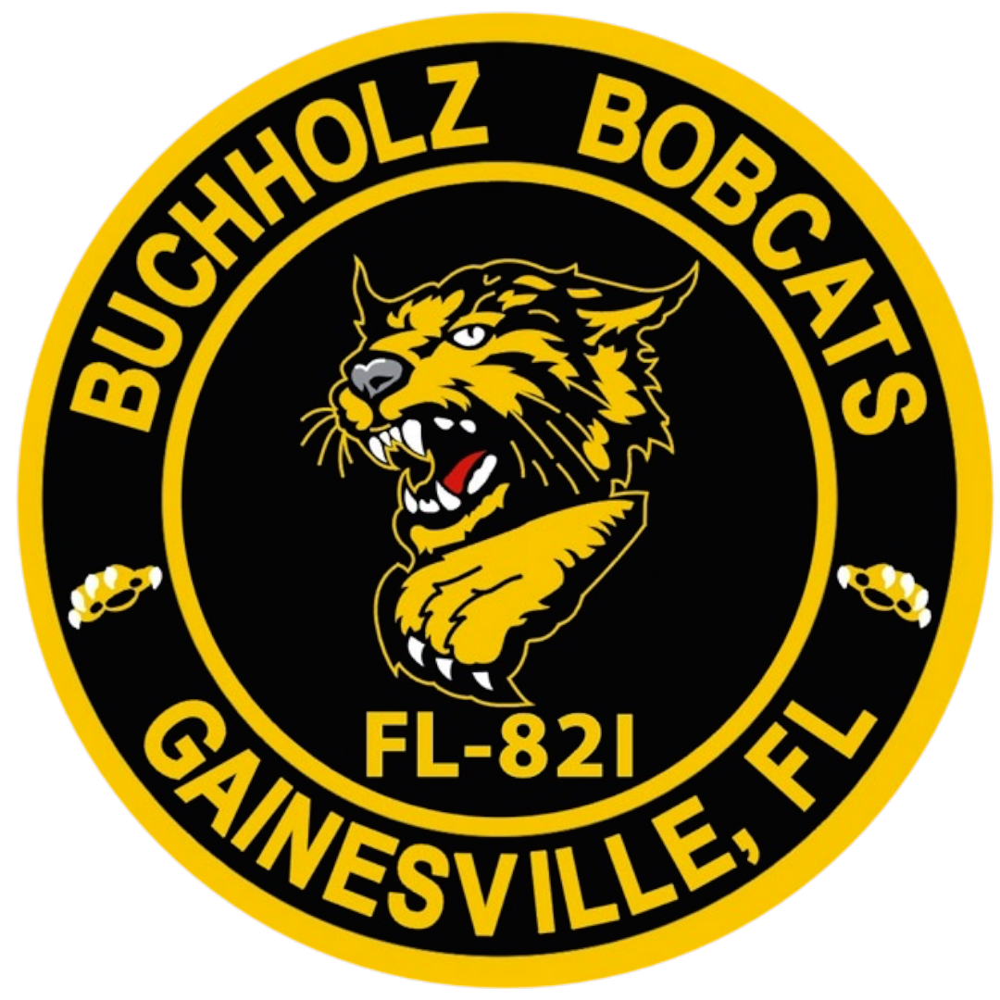

<!-- Main -->

<!-- One -->
<section id="one">
	

		<header class="major">
			<h2>Clients</h2>
		</header>
		
We have worked with a number of professional clients such as the ones featured below.

	

</section>

<!-- Two -->
<section id="two" class="spotlights">
	<section style="margin 0 auto;">
		

			<a href="https://www.sbac.edu/buchholz" width="166 vw" height="166 vw">
				
				
Buchholz Student Council

			</a>
		

		

			<a href="https://qopacademy.org" width="166 vw" height="166 vw">
				
				
Queen of Peace Catholic Academy

			</a>
		

		

			<a href="https://www.onesixone.ventures" width="166 vw" height="166 vw">
				
				
One Six One Ventures

			</a>
		

		

			<a href="https://sites.google.com/gm.sbac.edu/buchholz-afjrotc/home" width="166 vw" height="166 vw">
				
				
Buchholz AFJROTC

			</a>
		

		

			<a href="https://sites.google.com/gm.sbac.edu/academyofentrepreneurship/home" width="166 vw" height="166 vw">
				
				
Academy of Entrepreneurship

			</a>
		

		

			<a href="http://www.pagasagainesville.org/news.html" width="166 vw" height="166 vw">
				
				
PAGASA Gainesville

			</a>
		

	</section>
</section>

