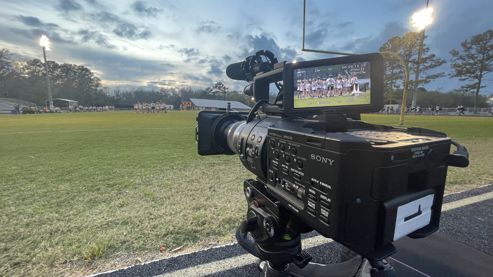
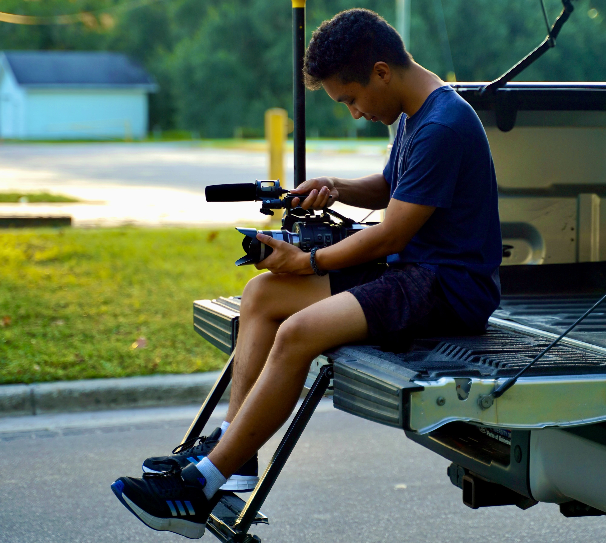

<!-- Main -->

<!-- One -->
<section id="one">
	

		<header class="major">
			<h2>Equipment</h2>
		</header>
    

</section>

<!-- Two -->
<section id="two">
    

        <header class="content">
        

            <h3>Cameras</h3>
            <ul>
                <li>Sony FS700</li>
                <li>Sony A6600</li>
            </ul>
            <h3>Lenses</h3>
            <ul>
                <li>Sony 18-200 F3.5-6.3</li>
                <li>Sony 18-135 F3.5-5.6</li>
                <li>Sony 24 F1.8</li>
            </ul>
            <h3>Grip</h3>
            <ul>
                <li>(2) Fluid head tripod</li>
                <li>Hi hat</li>
                <li>DJI Ronin S</li>
                <li>(2) Bi color LED panel kit</li>
            </ul>
            <h3>Video Distribution</h3>
            <ul>
                <li>Blackmagic ATEM Mini Pro</li>
                <li>(2) Hollyland Mars 300 Pro</li>
            </ul>
            <h3>Other</h3>
            <ul>
                <li>Deity Pocket Mic</li>
                <li>RocknRoller R6RT with table</li>
                <li>Slate</li>
            </ul>
        

        

            
            
        

           